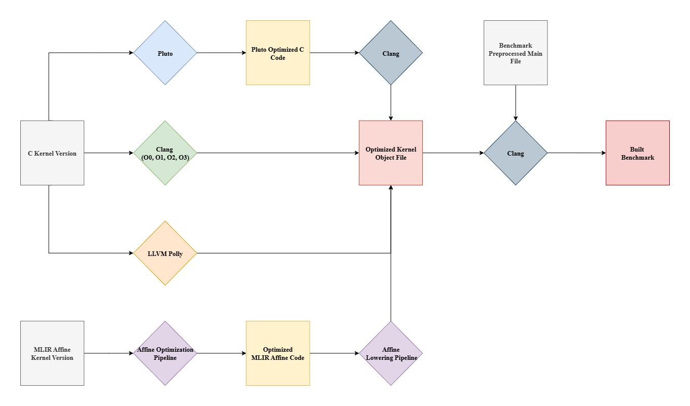

# Kiriko: A Framework for the Comparative Analysis of Polyhedral Optimization Tools

## Overview
Kiriko is a framework designed to facilitate the analysis and the evaluation of polyhedral optimization tools. It provides a structured environment for evaluating and benchmarking different polyhedral optimization techniques, enabling researchers and developers to assess their performance and effectiveness in various scenarios. 
Kiriko is constructed based on the PolyBench/C benchmark suite, and presents a new version of PolyBench written in MLIR Affine dialect. The MLIR Affine version of PolyBench allows users to evaluate the optimizations presented by the MLIR Affine dialect or even evaluate other dialects optimizations.

Kiriko supports the evaluation of Clang standard optimization (such as -O2 and -O3), but particularly Kiriko supports the evalutation of the following polyhedral compilers/optimization tools:
- [LLVM Polly](https://polly.llvm.org)
- [MLIR Affine dialect](https://mlir.llvm.org/docs/Dialects/Affine/)
- [Pluto](https://pluto-compiler.sourceforge.net)

## Workflow
The MLIR Affine version of PolyBench was generated with the help of [Polygeist](https://github.com/llvm/Polygeist), with several manual modifications. To do that, was necessary to generate the preprocessed C code of PolyBench/C to solve issues with macros expansion and include directives. The kernel functions of the benchmarks were then extracted from the preprocessed C code and converted to MLIR with the help of Polygeist. To maintain the consistency between the C and MLIR versions of the workflow, both version uses the preprocessed C version of the benchmark as the main file to compile and link with the kernel functions.

The optimization and compilation workflow of Kiriko is as follows:

## Installation

# Experiments and Results