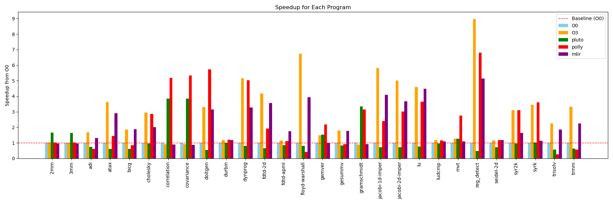
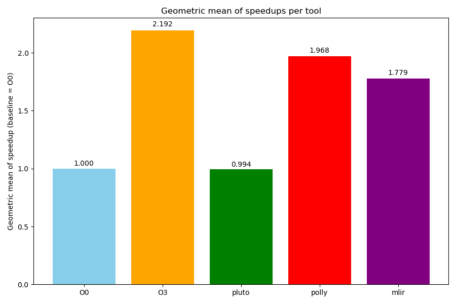

# Kiriko: A Framework for the Comparative Analysis of Polyhedral Optimization Tools


## Overview
Kiriko is a framework designed to facilitate the analysis and the evaluation of polyhedral optimization tools. It provides a structured environment for evaluating and benchmarking different polyhedral optimization techniques, enabling researchers and developers to assess their performance and effectiveness in various scenarios. 
Kiriko is constructed based on the PolyBench/C benchmark suite, and presents a new version of PolyBench written in MLIR Affine dialect. The MLIR Affine version of PolyBench allows users to evaluate the optimizations presented by the MLIR Affine dialect or even evaluate other dialects optimizations.

Kiriko supports the evaluation of Clang standard optimization (such as -O2 and -O3), but particularly Kiriko supports the evalutation of the following polyhedral compilers/optimization tools:
- [LLVM Polly](https://polly.llvm.org)
- [MLIR Affine dialect](https://mlir.llvm.org/docs/Dialects/Affine/)
- [Pluto](https://pluto-compiler.sourceforge.net)

## Workflow
The MLIR Affine version of PolyBench was generated with the help of [Polygeist](https://github.com/llvm/Polygeist), with several manual modifications. To do that, was necessary to generate the preprocessed C code of PolyBench/C to solve issues with macros expansion and include directives. The kernel functions of the benchmarks were then extracted from the preprocessed C code and converted to MLIR with the help of Polygeist. To maintain the consistency between the C and MLIR versions of the workflow, both version uses the preprocessed C version of the benchmark as the main file to compile and link with the kernel functions.

The optimization and compilation workflow of Kiriko is as follows:


## Installation

To a fully functional Kiriko installation, you will need to have the following dependencies installed:
- A LLVM installation with Polly, MLIR and Clang tools.
- A Pluto installation.
- Python 3.10 or higher.

During Kiriko's construction, it was tested with the following versions of the dependencies:

| Dependency | Version   | Installation Link                            |
|------------|-----------|----------------------------------------------|
| clang      | >= 20.1   | [llvm.org](https://llvm.org/docs/CMake.html) |
| mlir       | >= 20.1   | [llvm.org](https://llvm.org/docs/CMake.html)      |
| Pluto      | >= 0.13.0 | [pluto](https://pluto-compiler.sourceforge.net)      |
| Python     | >= 3.10   | [python.org](https://www.python.org/downloads/)      |

## Usage
First, if the tools are not in your system PATH, you can use environment variables to point to the correct paths of the tools, for instance `export CLANG_PATH=/path/to/clang`. The following environment variables are supported:
- CLANG_PATH: Path to the clang binary.
- LLC_PATH: Path to the llc binary.
- POLYCC_PATH: Path to the pluto binary.
- MLIR_OPT_PATH: Path to the mlir-opt binary.
- MLIR_TRANSLATE_PATH: Path to the mlir-translate binary.
- SAMPLE_SIZE: Number of times to run each benchmark.
  
Also, you can define the sample size (number of executions of each benchmark) by changing the SAMPLE_SIZE setting it on your environment variables. By default, SAMPLE_SIZE is set to 1.

To run the benchmarks, simply execute the `runBenchmarks.py` script located in the `Scripts` folder:
```bash
python3 Scripts/runBenchmarks.py
```

This will compile all benchmarks with the pipelines described in the workflow section. Basically, the script follows the following algorithm to run the benchmarks:
```bash

for each optimization tool:
    for each benchmark in PolyBenchC-MLIR:
        Compile the benchmark with the optimization tool
for each iteration in SAMPLE_SIZE:
    for each benchmark in PolyBenchC-MLIR:
        for each optimization tool:
            Run the benchmark and collect execution time and other metrics

```
## Reports
Kiriko produces detailed reports containing multiple features for each benchmark, including execution time (in seconds) and a set of dynamic metrics collected via Linux Perf. A separate report is generated for each optimization tool during each iteration.  

For example, a simplified report looks like this:

| Program                | Runtime (s) | CPU Cycles     | Instructions     | Cache References | Cache Misses | Branch Instructions |
|------------------------|-------------|----------------|-----------------|-----------------|--------------|-------------------|
| correlation_main_pluto | 1.278681    | 4,497,212,873  | 13,139,238,326  | 6,101,380       | 828,954      | 162,230,011       |
| covariance_main_pluto  | 1.549036    | 4,436,077,379  | 12,757,970,351  | 6,644,667       | 939,567      | 156,992,355       |
| 2mm_main_pluto         | 8.467904    | 29,707,093,247 | 61,769,761,638  | 24,905,749      | 1,198,999    | 108,267,786       |
| 3mm_main_pluto         | 12.702359   | 44,694,208,756 | 90,844,029,786  | 30,815,812      | 1,417,353    | 137,563,700       |
| atax_main_pluto        | 0.170395    | 918,449,051    | 1,253,846,204   | 5,533,454       | 5,037,068    | 41,868,709        |
| bicg_main_pluto        | 0.155605    | 889,542,611    | 1,149,779,010   | 7,553,389       | 6,689,063    | 44,877,607        |
| cholesky_main_pluto    | 0.514379    | 1,769,998,202  | 5,402,176,141   | 2,097,682       | 938,806      | 352,451,464       |
| doitgen_main_pluto     | 2.111096    | 7,602,320,129  | 13,448,541,237  | 9,608,746       | 1,084,033    | 18,454,140        |

For experiments with multiple iterations, the script `process_results.py` can generate a unified report calculating the **mean**, **median**, **standard error**, **max**, and **min** for each metric across iterations.  

---

## Experiments and Results
As a proof of concept, we conducted an initial experiment testing all optimization technologies available in Kiriko: Clang (O0–O3), LLVM Polly, Pluto, and MLIR Affine. You can the raw report files of this experiment here: [Raw Reports](assets/Results)  
The experiment used **SAMPLE_SIZE = 30**, meaning each benchmark was executed 30 times per tool. The system configuration was:

| **Feature**           | **Value** |
|------------------------|-----------|
| CPU Model             | Intel(R) Xeon(R) CPU E5-2680 v2 @ 2.80GHz |
| Total CPUs            | 40 |
| Sockets               | 2 |
| Cores per Socket      | 10 |
| Threads per Core      | 2 |
| Total Cores/Threads   | 20 cores / 40 threads |
| L3 Cache              | 50 MiB |
| OS                    | Ubuntu 20.04.6 LTS | 
| RAM Size              | 32 GB (8 × 4 GB) |
| RAM Type              | DDR3 @ 1333 MT/s |

We measured the runtime of each benchmark across all compiler tools. Each program’s **average runtime** was used to compute speedups relative to the baseline, represented by the red line. A speedup greater than 1 indicates faster execution.
This visualization allows us to examine the distinctive characteristics of each optimizer, identifying the benchmarks where they perform better or worse.

> **Note:** The benchmark `gemm` was excluded from the speedup chart for clarity, as its results were extreme: `O3`: 1.045, `Pluto`: 1.72, `Polly`: 26.98, `MLIR`: 0.97.  

  

We also calculated the **geometric mean** across all programs speedups.  

<p align="center">
  
</p>

This approach highlights both the **best-performing tool for each program** and the **general efficiency** across the benchmark suite.


